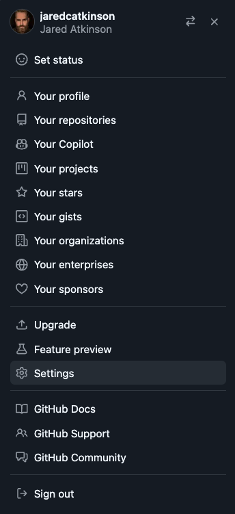
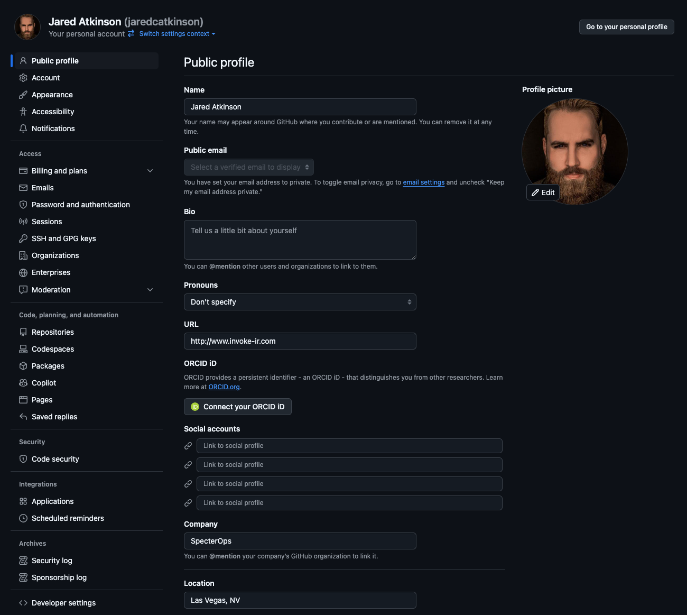
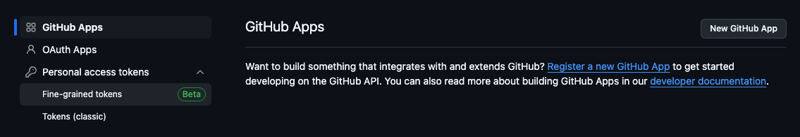
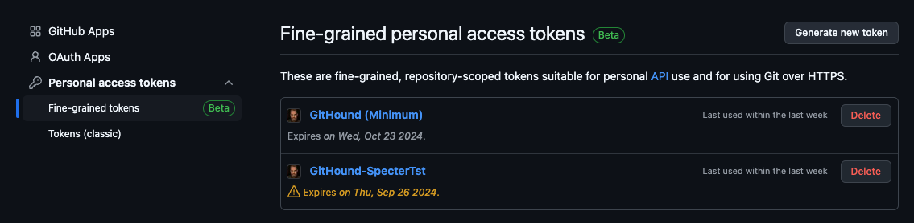
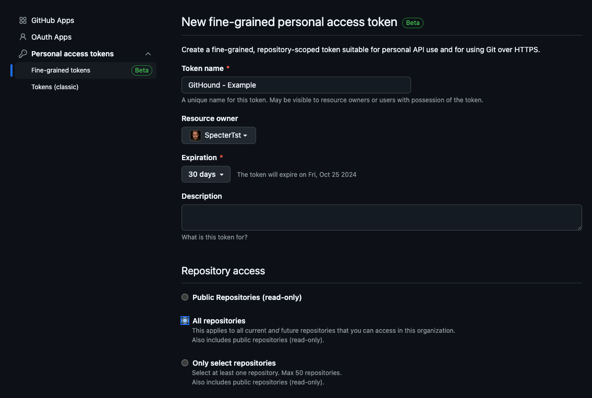
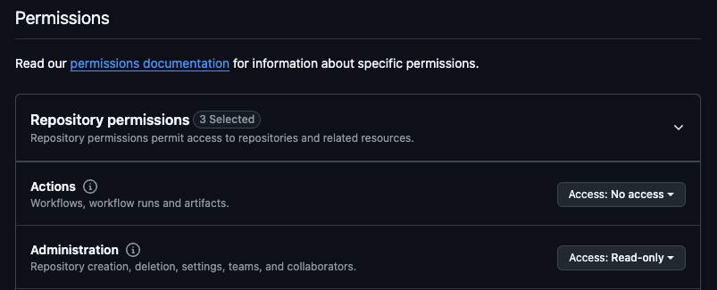
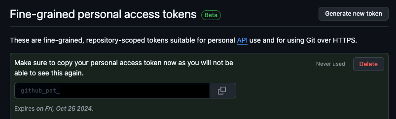

# GitHound

## Overview

**GitHound** is a BloodHound OpenGraph collector for GitHub, designed to map your organization’s structure and permissions into a navigable attack‑path graph. It:

- **Models Key GitHub Entities**  
  - **GHOrganization**: Your GitHub org metadata  
  - **GHUser**: Individual user accounts in the org  
  - **GHTeam**: Teams that group users for shared access  
  - **GHRepository**: Repositories within the org  
  - **GHBranch**: Named branches in each repo  
  - **GHOrgRole**, **GHTeamRole**, **GHRepoRole**: Org‑, team‑, and repo‑level roles/permissions  

- **Visualize & Analyze in BloodHound**  
  - **Access Audits**: See at a glance who has admin/write/read on repos and branches  
  - **Compliance Checks**: Validate least‑privilege across teams and repos  
  - **Incident Response**: Trace privilege escalations and group memberships  

With GitHound, you get a clear, interactive graph of your GitHub permissions landscape—perfect for security reviews, compliance audits, and rapid incident investigations.  

## Collector Setup & Usage

### Creating a Personal Access Token Overview

Settings -> Developer settings -> Personal access tokens -> Fine-grained tokens -> Generate new token

* Repository access -> All repositories

* "Administrator" repository permissions (read)
* "Contents" repository permissions (read)
* "Metadata" repository permissions (read)

* "Custom organization roles" organization permissions (read)
* "Custom repository roles" organization permissions (read)
* "Members" organization permissions (read)

### Generate Fine-grained Personal Access Token (Detailed)

This walkthrough is for administrators to create the Fine-grained Personal Access Token that is necessary to collect the data that is necessary for the GitHub based BloodHound Graph. These steps should be followed in the context of an organization administrator in order to ensure the resulting PAT will have full access to Repositories, Users, and Teams in the GitHub Organization.

#### Generate Token

To generate a personal access token browse to your user settings as shown in the image below:



In the settings menu, scroll to the bottom where you will see the "Developer settings" menu option. Click it.



GitHub offers many options for programmatic access. GitHound, our collector, is built to work with Fine-grained Personal Access Tokens, so click on that menu item.



After reaching the Fine-grained Personal Access Token page, you can click on the "Generate new token" button in the top right corner.



#### Token Settings

Fine-grained Personal Access Tokens offer administrators the ability to specifically control what resources the PAT will have access to.

It is possible to limit the set of repositories that a Fine-grained PAT can interact with. GitHound requires access to all repositories, so we will select the "All repositories" radio button.



Next, we will define the specific repository and organization permissions that GitHound requires. GitHound is a read-only tool, so we will make sure to specify read-only access for each option as shown in the image below:



The following permissions are required:

| Target       | Permission                | Access    |
|--------------|---------------------------|-----------|
| Repository   | Administrator             | Read-only |
| Repository   | Contents                  | Read-only |
| Repository   | Metadata                  | Read-only |
| Organization | Administrator             | Read-only |
| Organization | Custom organization roles | Read-only |
| Organization | Custom repository roles   | Read-only |
| Organization | Members                   | Read-only |

#### Save Personal Access Token

Once the PAT is created, GitHub will present it to you as shown below. You must save this value (preferably in a password manager) at this point as you will not be able to recover it in the future.



### Function Table

| Function Name         | Input Data     | Data Type      | API Endpoint | Fine-grained PAT Permissions |
|-----------------------|----------------|----------------|--------------|------------------------------|
| Git-HoundOrganization | None           | GHOrganization | [Get an organization](https://docs.github.com/en/enterprise-cloud@latest/rest/orgs/orgs?apiVersion=2022-11-28#get-an-organization) | None |
| Git-HoundTeam         | GHOrganization | GHTeam         | [List teams](https://docs.github.com/en/enterprise-cloud@latest/rest/teams/teams?apiVersion=2022-11-28#list-teams) | "Members" organization permissions (read) |
| Git-HoundUser         | GHOrganization | GHUser         | [List organization members](https://docs.github.com/en/enterprise-cloud@latest/rest/orgs/members?apiVersion=2022-11-28#list-organization-members) | "Members" organization permissions (read) |
| Git-HoundRepository   | GHOrganization | GHRepository   | [List organization repositories](https://docs.github.com/en/enterprise-cloud@latest/rest/repos/repos?apiVersion=2022-11-28#list-organization-repositories) | "Metadata" repository permissions (read) |
| Git-HoundBranch       | GHRepository   | GHBranch       | [List branches](https://docs.github.com/en/enterprise-cloud@latest/rest/branches/branches?apiVersion=2022-11-28#list-branches) | "Contents" repository permissions (read) |
| Git-HoundBranch       | GHRepository   | GHBranch       | [Get branch protection](https://docs.github.com/en/enterprise-cloud@latest/rest/branches/branch-protection?apiVersion=2022-11-28#get-branch-protection) | "Administration" repository permissions (read) |
| Git-HoundRole         | GHOrganization | GHRole         | [List teams](https://docs.github.com/en/enterprise-cloud@latest/rest/teams/teams?apiVersion=2022-11-28#list-teams) | "Members" organization permissions (read) |
| Git-HoundRole         | GHOrganization | GHRole         | [List team members](https://docs.github.com/en/enterprise-cloud@latest/rest/teams/members?apiVersion=2022-11-28#list-team-members) | None |
| Git-HoundRole         | GHOrganization | GHRole         | [List team membership for a user](https://docs.github.com/en/enterprise-cloud@latest/rest/teams/members?apiVersion=2022-11-28#get-team-membership-for-a-user) | None |
| Git-HoundRole         | GHOrganization | GHRole         | [List custom repository roles in an organization](https://docs.github.com/en/enterprise-cloud@latest/rest/orgs/custom-roles?apiVersion=2022-11-28#list-custom-repository-roles-in-an-organization) | "Custom repository roles" organization permissions (read) or "Administration" organization permissions (read) |
| Git-HoundRole         | GHOrganization | GHRole         | [List organization repositories](https://docs.github.com/en/enterprise-cloud@latest/rest/repos/repos?apiVersion=2022-11-28#list-organization-repositories) | "Metadata" repository permissions (read) |
| Git-HoundRole         | GHOrganization | GHRole         | [List repository collaborators](https://docs.github.com/en/enterprise-cloud@latest/rest/collaborators/collaborators?apiVersion=2022-11-28#list-repository-collaborators) | "Metadata" repository permissions (read) |
| Git-HoundRole         | GHOrganization | GHRole         | [List repository teams](https://docs.github.com/en/enterprise-cloud@latest/rest/repos/repos?apiVersion=2022-11-28#list-repository-teams) | "Administration" repository permissions (read) |
| Git-HoundRole         | GHOrganization | GHRole         | [Get all organization roles for an organization](https://docs.github.com/en/enterprise-cloud@latest/rest/orgs/organization-roles?apiVersion=2022-11-28#get-all-organization-roles-for-an-organization) | "Custom organization roles" organization permission (read) |
| Git-HoundRole         | GHOrganization | GHRole         | [List organization members](https://docs.github.com/en/enterprise-cloud@latest/rest/orgs/members?apiVersion=2022-11-28#list-organization-members) | "Members" organization permissions (read) |
| Git-HoundRole         | GHOrganization | GHRole         | [Check organization membership for a user](https://docs.github.com/en/enterprise-cloud@latest/rest/orgs/members?apiVersion=2022-11-28#check-organization-membership-for-a-user) | "Members" organization permissions (read) |

## Schema

### Nodes

Nodes correspond to each object type.

| Node                                                                     | Description                                                                                    | Icon        | Color   |
|--------------------------------------------------------------------------|------------------------------------------------------------------------------------------------|-------------|---------|
|  GHOrganization | A GitHub Organization—top‑level container for repositories, teams, & settings.               | building    | #5FED83 |
|  GHUser                 | An individual GitHub user account.                                                             | user        | #FF8E40 |
|  GHTeam                 | A team within an organization, grouping users for shared access and collaboration.             | user-group  | #C06EFF |
|  GHRepository     | A code repository in an organization (or user account), containing files, issues, etc.         | box-archive | #9EECFF |
|  GHBranch             | A named reference in a repository (e.g. `main`, `develop`) representing a line of development. | code-branch | #FF80D2 |
|  GHOrgRole           | The role a user has at the organization level (e.g. `admin`, `member`).                        | user-tie    | #BFFFD1 |
|  GHTeamRole         | The role a user has within a team (e.g. `maintainer`, `member`).                               | user-tie    | #D0B0FF |
|  GHRepoRole         | The permission granted to a user or team on a repository (e.g. `admin`, `write`, `read`).      | user-tie    | #DEFEFA |

### Edges

Edges capture every relationship; who contaiins what, membership, read vs. write permissions, etc.

## Usage Examples

## Contributing

We welcome and appreciate your contributions! To make the process smooth and efficient, please follow these steps:

1. **Discuss Your Idea**  
   - If you’ve found a bug or want to propose a new feature, please start by opening an issue in this repo. Describe the problem or enhancement clearly so we can discuss the best approach.

2. **Fork & Create a Branch**  
   - Fork this repository to your own account.  
   - Create a topic branch for your work:
     ```bash
     git checkout -b feat/my-new-feature
     ```

3. **Implement & Test**  
   - Follow the existing style and patterns in the repo.  
   - Add or update any tests/examples to cover your changes.  
   - Verify your code runs as expected:
     ```bash
     # e.g. dot-source the collector and run it, or load the model.json in BloodHound
     ```

4. **Submit a Pull Request**  
   - Push your branch to your fork:
     ```bash
     git push origin feat/my-new-feature
     ```  
   - Open a Pull Request against the `main` branch of this repository.  
   - In your PR description, please include:
     - **What** you’ve changed and **why**.  
     - **How** to reproduce/test your changes.

5. **Review & Merge**  
   - I’ll review your PR, give feedback if needed, and merge once everything checks out.  
   - For larger or more complex changes, review may take a little longer—thanks in advance for your patience!

Thank you for helping improve this extension! 🎉  

## Licensing

```
Copyright 2025 Jared Atkinson

Licensed under the Apache License, Version 2.0
you may not use this file except in compliance with the License.
You may obtain a copy of the License at

    http://www.apache.org/licenses/LICENSE-2.0

Unless required by applicable law or agreed to in writing, software
distributed under the License is distributed on an "AS IS" BASIS,
WITHOUT WARRANTIES OR CONDITIONS OF ANY KIND, either express or implied.
See the License for the specific language governing permissions and
limitations under the License.
```

Unless otherwise annotated by a lower-level LICENSE file or license header, all files in this repository are released
under the `Apache-2.0` license. A full copy of the license may be found in the top-level [LICENSE](LICENSE) file.
